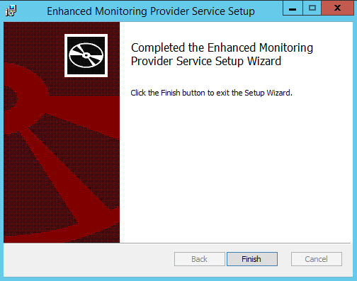

#How to install and configure the Enhanced Monitoring Service on Windows Server 2012 R2 Hyper-V

The Enhanced Monitoring Service is a Windows service at the Hyper-V parent partition which makes enhanced configuration and performance information for a virtual machine accessible from within the virtual machine. This information might be related to the parent partition as well as to the virtual machine. 
The data exchange channel used between the parent partition and its virtual machines relies on the [KVP data exchange machanism](https://technet.microsoft.com/en-us/library/dn798297.aspx). This mechanism is implemented as a read-only interface between parent partition and its virtual machines, so that no changes on the parent partition can be triggered by the virtual machine through that interface.

##Prerequisites

You use Windows Server 2012 R2 Hyper-V. 
	
##Enable the Enhanced Monitoring

To enable the Enhanced Monitoring for a virtual machine, you have to:

* Enable the Hyper-V parent partition to provide Enhanced Monitoring data to the virtual machine

* Enable the virtual machine to receive Enhanced Monitoring data

By the two-step approach during enablement of the Enhanced Monitoring, you have full control on which virtual machines you enable the Enhanced Monitoring data. If you want to disallow a certain virtual machine to view Enhanced Monitoring data, don't enable the activation parameter on virtual machine level so that no monitoring data are collected.

### On the Hyper-V parent partition: Install the Enhanced Monitoring Service

To install the Enhanced Monitoring Service, execute the following steps on the Hyper-V parent partition:

1. Download the installation package [EnhancedMonitoring.msi](https://github.com/OSTC/enhanced-monitoring-service/releases/download/v1.1/EnhancedMonitoring.msi).

3. Execute the installation package to install the Enhanced Monitoring Service.

  

3. After the installation, confirm that the Windows service "Enhanced Monitoring Provider Service" is running, and that its Startup Type is set to "Automatic (Delayed Start)".

  

###On the Virtual Machine: Activate the Enhanced Monitoring

Activate the Enhanced Monitoring on the virtual machine by setting the key-value-pair ```Enhanced_Monitoring_Supported=1```. Only if this key-value-pair is set inside the virtual machine, the Enhanced Monitoring Service will populate the KVP data exchange channel with monitoring data for this virtual machine.

To set the key-value-pair inside the virtual machine, proceed as follows:
* **Guest OS Linux**: 

  Write the key-value-pair ```Enhanced_Monitoring_Supported=1``` to the file ```/var/lib/hyperv/.kvp_pool_1```. 

* **Guest OS Windows**: 

  Open the Windows registry and change to the registry key ```HKEY_LOCAL_MACHINE\SOFTWARE\Microsoft\Virtual Machine\Guest```.

Create a ```REG_DWORD``` value with the name ```Enhanced_Monitoring_Supported``` and set its value to 1.

Note: Make sure that the virtual machines to monitor have different names and that the virtual machine name does not contain one of the following characters:
```( ) * / # "```
This limitation is introduced by Hyper-V.

##How to Configure and Access the Enhanced Monitoring Data

###How to Access Enhanced Monitoring Data on the Virtual Machine

If you have configured the virtual machine to receive monitoring data by adding the key-value-pair described above, the parent partition will provide enhanced monitoring information to the guest VM through the KVP channel.
The enhanced monitoring data is provided as follows:
* **Guest OS Linux**: 

  In a Linux VM the monitoring data is part of the tree ```/var/lib/hyperv/.kvp_pool_0```.

* **Guest OS Windows**: 

  In a Windows VM, the data is provided under the registry key ```HKEY_LOCAL_MACHINE \SOFTWARE\Microsoft\Virtual Machine\External```.

The performance data is base64-encoded and split into multiple parts to follow the length limitation of the KVP channel. 
For sample code on how to parse the data within the virtual machine, check the following [sample](/sample).

###How to Configure the Enhanced Monitoring Service

The Enhanced Monitoring Service collects by default the information which is part of its configuration file
```C:\ProgramData\Enhanced Monitoring\EnhancedMonitoringProviderConfig.xml```. 

Microsoft advises to leave the configuration file unchanged. However, you could add further information to be collected by the service to this configuration file or you might want to increase the log level of the Enhanced Monitoring Service for troubleshooting purposes. 

**Note**: Any modification to the configuration file will only take effect after you restart the Windows service ‘Enhanced Monitoring Provider Service’.

###How to Configure the Refresh Interval of the Enhanced Monitoring Data

By default, the Enhanced Monitoring Service updates the monitoring data for its virtual machines within a refresh interval of 60 seconds.

However, if you have a large number of guest VMs (more than 40) running on the same parent partition, the KVP mechanism might need too much time to collect and provision the required data to its virtual machines.
In this case, increase the refresh interval of the Enhanced Monitoring Service to 120 seconds by setting the value for parameter "RefreshRate" in the configuration file to 120.
```
  <!-- Refresh interval in seconds-->
  <!-- Mandatory -->
  <RefreshRate>120</RefreshRate>
```
To adapt the configuration file of the Enhanced Monitoring Service, proceed as described in section ‘How to Configure the Enhanced Monitoring Service’.

###How to Increase the WMI quota

The Enhanced Monitoring Service relies on the WMI Provider Service to monitor the performance and resource status of the parent partition. However, the WMI Provider Service has a resource limitation for threads, memory, etc. If you have a large number of virtual machines (more than 40), you need to increase the WMI quota, and otherwise you let it unchanged. Likewise, if you have other workloads that might use the WMI Provider Service running on the same host, you also need to increase the quota.
To increase the WMI quota, follow [How to Increase WMI quota](http://blogs.technet.com/b/askperf/archive/2008/09/16/memory-and-handle-quotas-in-the-wmi-provider-service.aspx).

##Troubleshoot the Enhanced Monitoring

###Check the Enhanced Monitoring Service logs


The Enhanced Monitoring Service writes information during runtime and collection of the monitoring data to the directory tree ```C:\ProgramData\Enhanced Monitoring\log```. In case of any issues during collection of the enhanced monitoring data, check the content of this directory tree on your Hyper-V parent partition.


If you cannot find log entries related to your issues, you might temporarily increase the log level of the Enhanced Monitoring service by setting the parameter LogLevel to ```Verbose```.
```
  <!-- Optional -->
  <LogLevel>Verbose</LogLevel>
```
Proceed as described in section ‘How to Configure the Enhanced Monitoring Service’.


