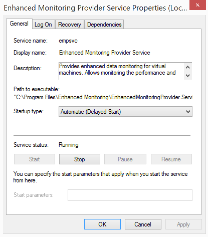

How to install Enhanced Monitoring Service on Windows Server 2012 R2
======
This tools provides enhanced data monitoring for virtual machines. It allows you to monitor the performance and resource status of the physical server from within the virtual machine.	

This tools relies on [KVP data exchange](https://technet.microsoft.com/en-us/library/dn798297.aspx) channel to pass monitoring data from host to guest VM.

Prerequisites:
------
None
	
Installation:
------
1. Download the EnhancedMonitoring.msi package
2. Run MSI to install the Enhanced Monitoring Service


Validate the installation:
-----
After installation, confirm you can find the "Enhanced Monitoring Provider Service" service from the services console, and it should be automatically started.


Configuration:
-----
#### Configure Enhanced Monitoring Service on Host
The configuration file path is ```C:\ProgramData\Enhanced Monitoring\EnhancedMonitoringProviderConfig.xml```. You could modify the configuration file to config Enhanced Monitoring Service. Please noticy that any modification to the configuration file will only take effect after you restart the service.

For example, You could turn on verbose log for trouble shooting by updating "LogLevel" in configuration file and restart the service.
```
  <!-- Optional -->
  <LogLevel>Info</LogLevel>
```
However, we don't advice you to monify the configuration file unless you know the consequences.
#### Configure VM to receive monitoring data
The VM needs to be configured before it could receive performance data from host. The configuration is to add a KVP named ```Enhanced_Monitoring_Supported``` in the VM. So that the host could read the KVP from KVP channel and recoginize that the VM is expecting monitoring data.

On Linux VM, the configuration could be done by writing a flag to file, ```/var/lib/hyperv/.kvp_pool_1```.
On Windows VM, the configuration could be down by creating a register key, ```HKLM:\SOFTWARE\Microsoft\Virtual Machine\Guest\Enhanced_Monitoring_Supported``` and set the value to 1.

The sample code could be found under [sample](/sample).

Read monitoring data inside a VM:
-----
After VM is configured to revceive monitoring data, host will send monitoring data to the VM through KVP channel.

On Linux VM, the data is under, ```/var/lib/hyperv/.kvp_pool_0```.
On Windows VM, the data is under register key, ```HKLM:\SOFTWARE\Microsoft\Virtual Machine\External```.

The data is base64-encoded and seperated into several parts to fit in length limitation of KVP channel.
The sample code for parsing the data could be found under [sample](/sample).
Trouble shooting:
-----
If any issue occurs, you can find log file under ```C:\ProgramData\Enhanced Monitoring\log```.


Limitations:
-----
#### VM name limitation
The Enhanced Monitoring Service has a limitation on VM name. The 2 VMs could not share the same name and the VM name could not contain the following charactors:
```
( ) * / # "
```
This limitation is introducded by HyperV.
#### Refresh Rate
If you have a huge number of VMs(more than 40) running on the same host. You need to increase refresh rate to 2 mins. You could do this by updating "RefreshRate" in configuration file and restart the service.
```
  <!-- Refresh interval in seconds-->
  <!-- Mandatory -->
  <RefreshRate>60</RefreshRate>
```
#### WMI quota
The Enhanced Monitoring Service relies on WMI Provider Service to monitor the performance and resource status of the physical server. However WMI Provider Service has limitaiton on resources(threads, memory, etc.). If you have a huge number of VMs, you need to increase the quota. If you have other work load that might use WMI Proviser Service running on the same host, also you need to increase the quota.

[How to Increase WMI quota](http://blogs.technet.com/b/askperf/archive/2008/09/16/memory-and-handle-quotas-in-the-wmi-provider-service.aspx)

